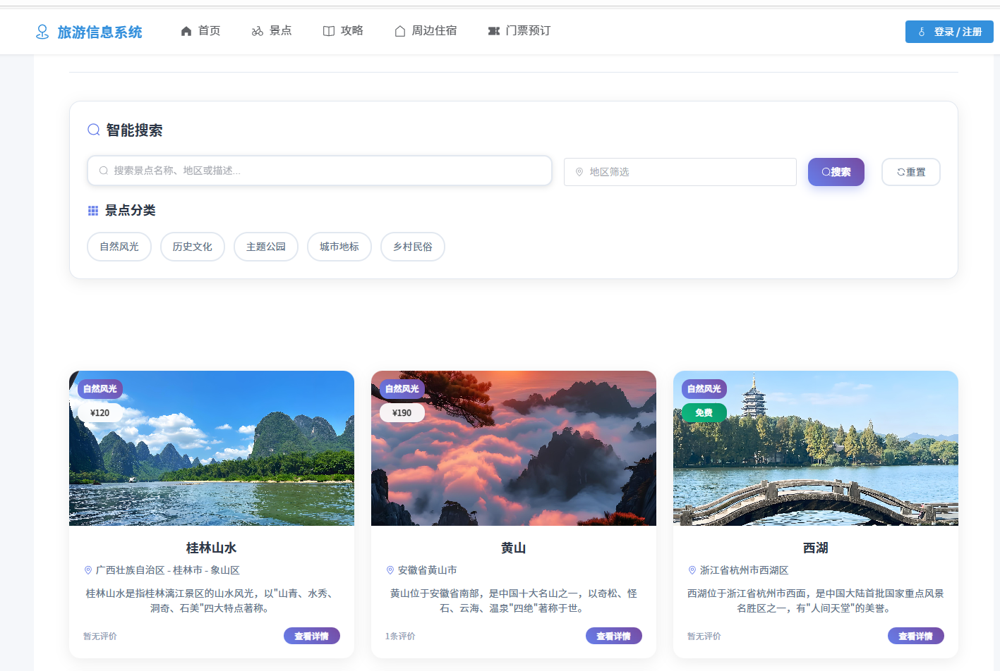
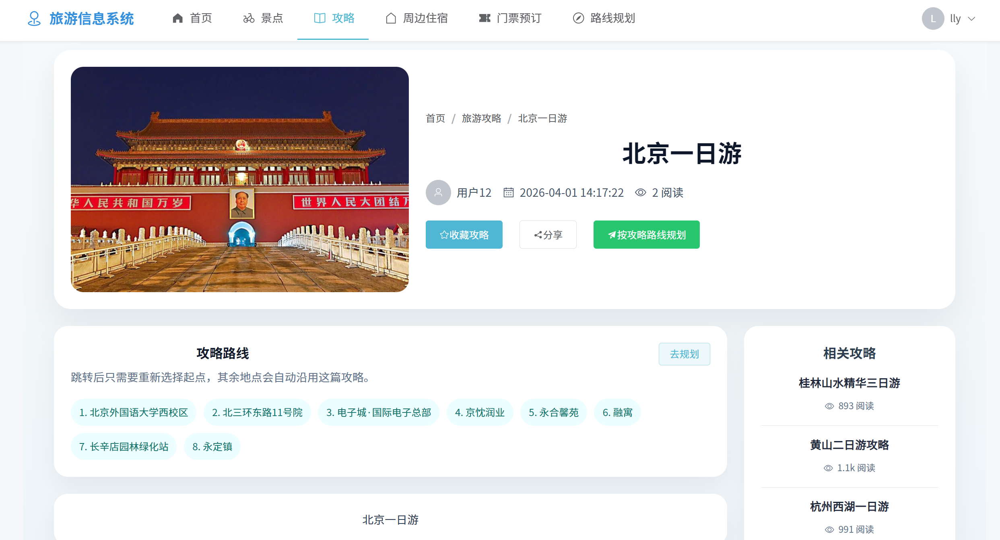
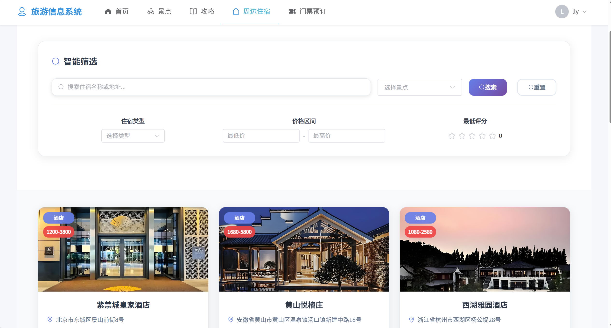
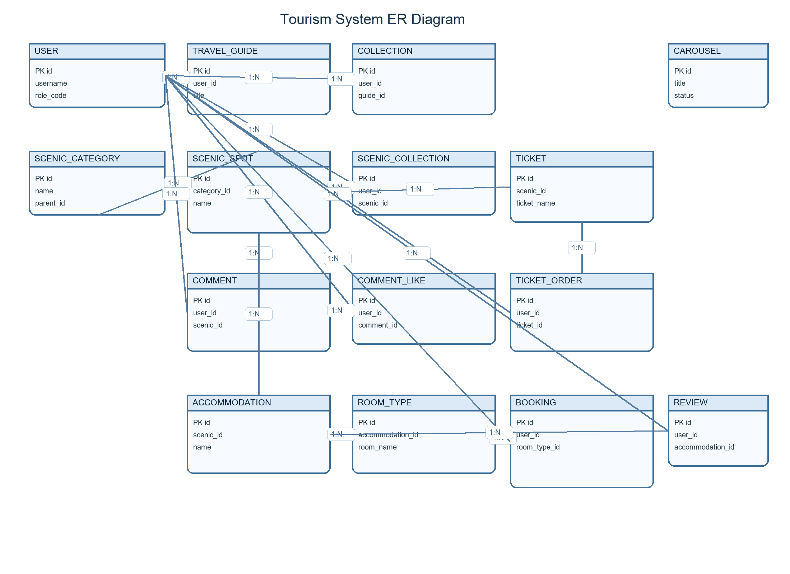

# Takeout Platform

基于 **Spring Boot 3 + Vue 3** 的外卖平台系统，采用 **前后端分离 + 多服务架构** 实现，包含用户端、商家端、骑手端和管理端等多个角色模块，支持点餐下单、优惠券、配送追踪、经营分析、风控管理、地图服务和支付宝沙箱支付。

## 项目简介

- `backend/`：后端 Maven 多模块工程，包含网关、公共基础包和 5 个业务服务
- `frontend/`：前端工作区，包含 4 个独立的 Vue 3 应用
- `operate_log.sql`：数据库初始化脚本（MySQL Dump）
- `docs/images/`：README 中使用的截图与示意图

本项目适合用于课程设计、毕业设计、项目实战或外卖平台业务学习参考。

## 核心功能

- **用户端**
  - 注册、登录、个人资料、收货地址管理
  - 浏览商家、商品详情、购物车、优惠券、下单支付
  - 订单列表、订单详情、配送进度追踪

- **商家端**
  - 店铺信息配置、配送范围与配送费设置
  - 商品管理、订单管理、评价管理
  - 营销活动、经营数据、门店运营分析

- **骑手端**
  - 待接订单、抢单、配送中订单、历史订单
  - 配送轨迹、路线规划、服务区域、实时通知
  - WebSocket 实时推送订单状态

- **管理端**
  - 用户、商家、骑手和订单的统一管理
  - 营销策略、风控预警、平台分析
  - 系统配置与运营数据查看

- **平台能力**
  - Nacos 注册发现
  - Redis 缓存与会话数据
  - MySQL 持久化
  - 高德地图地址解析与路线规划
  - 阿里云 OSS 图片存储
  - 支付宝沙箱支付

## 技术栈

**后端**

- Java 17
- Spring Boot 3.3.2
- Spring Cloud 2023.0.3
- Spring Cloud Alibaba 2023.0.1.2
- Spring Cloud Gateway
- Spring JDBC / JdbcTemplate
- Spring Data Redis
- Spring WebSocket
- Nacos
- Redis
- MySQL
- Knife4j
- Java JWT
- 阿里云 OSS SDK
- 支付宝沙箱支付

**前端**

- Vue 3
- Vue Router
- Vite
- Element Plus
- @element-plus/icons-vue

## 服务与端口

| 服务 / 应用 | 说明 | 默认端口 |
| --- | --- | --- |
| `takeout-gateway` | 网关入口 | `8088` |
| `takeout-user-service` | 用户端接口 | `8101` |
| `takeout-merchant-service` | 商家端接口 | `8102` |
| `takeout-rider-service` | 骑手端接口 / 配送轨迹 / 路线规划 | `8103` |
| `takeout-order-service` | 订单与支付 | `8104` |
| `takeout-admin-service` | 管理端接口 | `8105` |
| `user-app` | 用户端前台 | `5173` |
| `merchant-app` | 商家端后台 | `5174` |
| `rider-app` | 骑手端前台 | `5175` |
| `admin-app` | 管理端前台 | `5176` |

## 系统截图

> 以下图片来自你提供的截图资源，已统一放入 `docs/images/`。

| 用户端 | 商家端 |
| --- | --- |
|  |  |
| 骑手端 | 管理端 |
|  |  |

### 数据库 ER 图



## 项目结构

```text
Takeout-System
├─backend
│  ├─takeout-common
│  ├─takeout-gateway
│  ├─takeout-user-service
│  ├─takeout-merchant-service
│  ├─takeout-rider-service
│  ├─takeout-order-service
│  ├─takeout-admin-service
│  └─start/stop-*.ps1
├─frontend
│  ├─apps
│  │  ├─user-app
│  │  ├─merchant-app
│  │  ├─rider-app
│  │  └─admin-app
│  └─shared
├─docs
│  └─images
└─operate_log.sql
```

## 快速开始

### 1. 克隆项目

```bash
git clone https://github.com/lly710/Takeout-System.git
cd Takeout-System
```

### 2. 初始化数据库

创建数据库：

```sql
CREATE DATABASE takeout_platform DEFAULT CHARACTER SET utf8mb4 COLLATE utf8mb4_0900_ai_ci;
```

导入初始化脚本：

```bash
mysql -u root -p takeout_platform < operate_log.sql
```

### 3. 启动基础服务

请先启动：

- MySQL
- Redis
- Nacos

### 4. 启动后端服务

可以优先使用仓库内提供的 PowerShell 脚本启动部分服务：

```powershell
powershell -ExecutionPolicy Bypass -File backend\start-user-service.ps1
powershell -ExecutionPolicy Bypass -File backend\start-merchant-service.ps1
powershell -ExecutionPolicy Bypass -File backend\start-rider-service.ps1
```

> 上述服务请分别在不同终端窗口中执行；每个 `mvn spring-boot:run` 都会占用当前窗口。

其余服务可在对应模块目录下启动：

```bash
cd backend/takeout-gateway
mvn spring-boot:run

cd backend/takeout-order-service
mvn spring-boot:run

cd backend/takeout-admin-service
mvn spring-boot:run
```

### 5. 启动前端工作区

```bash
cd frontend
npm install
npm run dev:user
npm run dev:merchant
npm run dev:rider
npm run dev:admin
```

> `npm run dev:*` 也建议分别在不同终端中执行。

> 前端四个应用分别运行在 `5173 ~ 5176` 端口。

## 环境变量

### 后端必需

- `MYSQL_URL`
- `MYSQL_USERNAME`
- `MYSQL_PASSWORD`
- `REDIS_HOST`
- `REDIS_PORT`
- `REDIS_PASSWORD`
- `NACOS_SERVER_ADDR`
- `NACOS_USERNAME`
- `NACOS_PASSWORD`
- `TAKEOUT_JWT_SECRET`
- `TAKEOUT_JWT_EXPIRE_HOURS`
- `AMAP_WEB_SERVICE_KEY`
- `ALIYUN_OSS_ACCESS_KEY_ID`
- `ALIYUN_OSS_ACCESS_KEY_SECRET`
- `ALIYUN_OSS_BUCKET`
- `ALIYUN_OSS_PUBLIC_DOMAIN`
- `ALIPAY_APP_ID`
- `ALIPAY_PRIVATE_KEY`
- `ALIPAY_PUBLIC_KEY`
- `ALIPAY_RETURN_URL`
- `ALIPAY_NOTIFY_URL`
- `ALIPAY_FRONTEND_SUCCESS_URL`
- `ALIPAY_STRICT_VERIFY`
- `RIDER_SERVER_PORT`

### 前端必需

- `VITE_API_BASE_URL`
- `VITE_RIDER_SERVICE_URL`
- `VITE_RIDER_WS_URL`
- `VITE_RIDER_API_BASE_URL`
- `VITE_AMAP_KEY`
- `VITE_AMAP_SECURITY_JS_CODE`

> 建议将前端变量分别放在 `frontend/apps/<app>/.env.local` 中；后端变量可通过系统环境变量或启动脚本注入。

## 核心业务说明

- **订单与支付**：`takeout-order-service` 负责订单创建、订单状态流转以及支付宝沙箱支付页面 / 回调处理。
- **配送与轨迹**：`takeout-rider-service` 负责接单、路线规划、配送轨迹记录与 WebSocket 推送。
- **地图与地址**：用户端、商家端和骑手端都接入高德地图，用于地址解析、定位和配送半径配置。
- **缓存与会话**：公共模块统一封装了 Redis 缓存、JWT 登录态、异常处理和 OSS 上传能力。

## 部署提示

- 生产环境请将 `NACOS_*`、`MYSQL_*`、`REDIS_*`、`AMAP_*`、`ALIYUN_OSS_*`、`ALIPAY_*` 等变量替换为真实配置。
- 若需要公开部署，请先确认支付回调地址、前端访问地址以及骑手端 WebSocket 地址已正确配置。
- 可以先在本地验证 `operate_log.sql` 是否已成功导入，再启动各服务。

## License

当前仓库暂未添加开源许可证。若需对外发布，建议补充 `MIT` 或 `Apache-2.0` 等许可证文件。
